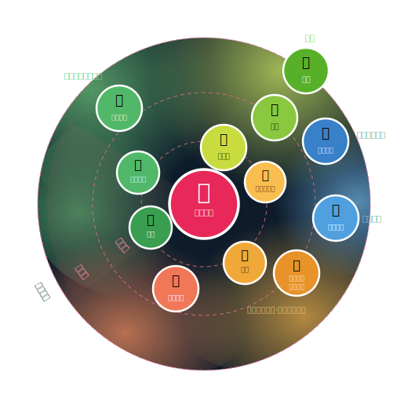
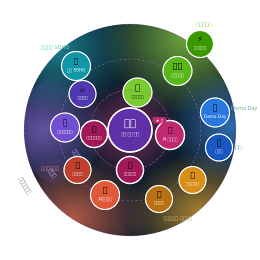
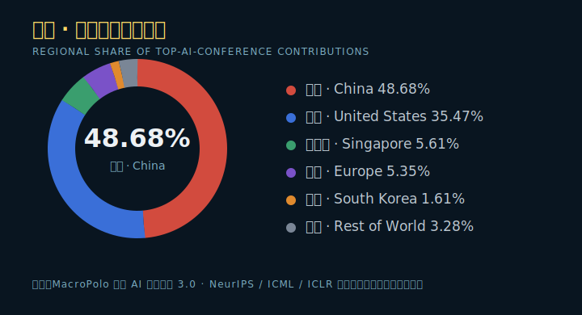
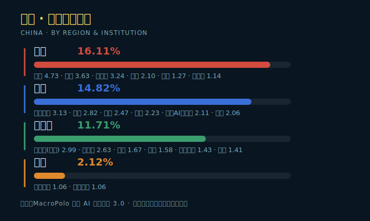
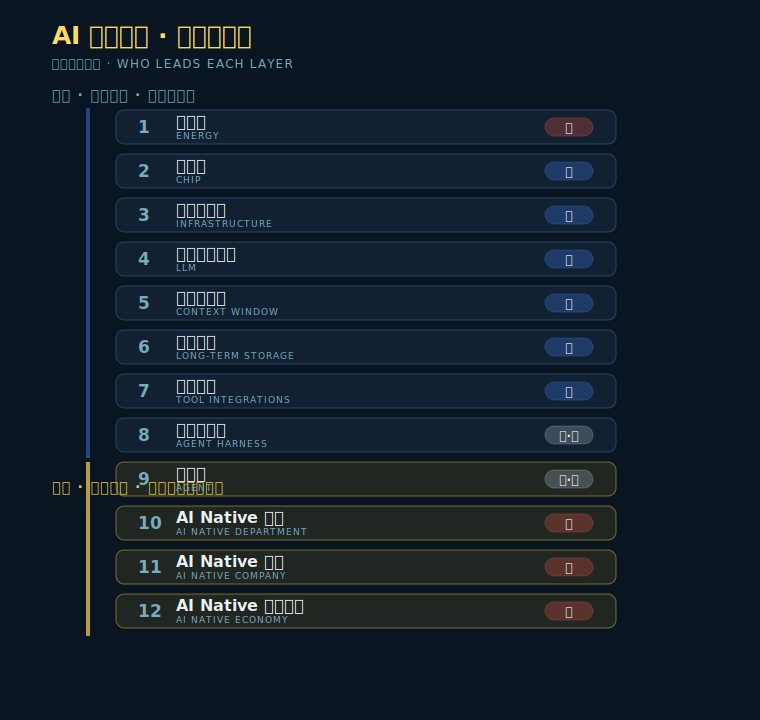

# 百年京张 AI 创新带城市设计 · 总体故事线
**Centennial Jingzhang AI Innovation Corridor · Master Narrative**  
*Tekuma · Final narrative aligned with `index.html`*

---

## 封面
**百年京张 AI 创新带**  
*Centennial Jingzhang AI Innovation Corridor · Master Narrative*

1909年，一条铁路以折返线破解了地形的束缚。  
百年之后，同一条线上，正在积蓄另一个时代的动能。

---

## 一、历史锚点：两次折返线，两次时代命题
**Historical Anchor: Two Switchbacks, Two Epochal Questions**

1909年，詹天佑主持修建京张铁路，面对八达岭险峻的陡坡，他没有选择正面硬攻，而是设计了**人字形折返线**——让列车借助两段反向坡道积蓄动力、转换方向，化解了近乎不可能的爬坡难题。

这是一种东方智慧：**不与障碍正面硬碰，而是通过巧妙的路径设计，让阻力本身转化为动力的一部分。**

百年之后，这条铁路沿线正在面对另一道陡坡。面对中美之间长期的 AI 战略竞争关系——

**中国在 AI 时代的折返线是什么？**  
*What is China's switchback in the age of artificial intelligence?*

不是推倒重来，而是因势利导，转换路径，让每一道陡坡都成为积蓄动力的弯道。

这是百年京张 AI 创新带城市设计所要回答的核心命题。

---

## 二、结构张力：两个悖论，是挑战也是机遇
**Structural Tensions: Two Paradoxes — Both Challenge and Opportunity**

### 城市学的悖论
**The Urban Paradox**

这里已经是**全球 AI 的地理中心**。清华、北大、中科院、智谱、字节、百度、小米……全球顶尖 AI 研发力量沿京张铁路沿线自然汇聚，这不是规划的结果，而是海淀历史沉淀的事实。然而迎接这些人才的，是**通勤拥堵的日常、边界分明的园区、缺乏生活品质的城市环境**。

### 产业竞争的悖论
**The Industry Paradox**

海淀的 AI 人才密度超过旧金山硅谷，但**创新成果的转化密度却相反**。问题不在于人，在于组织方式。旧金山的秘密从来不是天才的数量，而是**天才之间碰撞的频率**——产学研之间的渗透性、跨学科的交流密度、创新在非正式场合自然发生的空间结构。这些才是驱动创新的真正基础设施，而这里恰恰是缺失的。

这里拥有世界上最高的 AI 人才密度，如何**组织高密度人才实现持续有效的创新和转化**，是城市形态与产业组织方式都需要思考和解决的现实挑战，当然，更是这个时代给予海淀的向新人类文明进化探索的绝佳机遇。

---

## 中场定题：海淀的使命
**Haidian — Building a New Civilization for the Age of Artificial Intelligence**

**海淀，创造 AI 时代的新文明。**

| 战略支柱 | 英文定位 | 中文定位 |
|---|---|---|
| AI-First City | Global AI City Prototype | 全球 AI 城市样板 |
| AI + Every Industry | Global AI Industry Hub | 全球 AI 产业高地 |

---

## 三、双重定位与策略
**Dual Positioning & Strategy**

---

## 策略一：全球 AI 城市样板
**AI-First City · Global AI City Prototype — China's Answer to Urban Form in the Age of AI**

**全球 AI 城市样板**  
**AI 时代城市形态的中国答案**

人类每一次大规模聚集形态的变迁，都与生产资料和生产方式的转移息息相关。

**智能时代的核心生产资料是信任关系。** AI 时代的生产方式是社群化、即时化、高密度知识交换的，现有城市空间的组织逻辑还停留在工业时代——为通勤和工厂而设计，无法成为这种工作方式的最合适的空间载体。

AI-First City 的命题，**不是在城市里叠加 AI 技术，而是用 AI 时代的逻辑重新组织城市本身**：从居住方式、教育形态，到文化生活的组织逻辑，再到城市空间的整体形制，都需要重新定义。信任只在真实关系中生长，意义只在共同体中被确认，判断力只在真实摩擦中被锻造。当 AI 开始接管效率工作，人类终于可以把“如何共同生活得有意义”作为城市设计的第一命题。

这一命题也将助力海淀成为**全球 AI 城市转型的参照系和朝圣地**。

---

## 策略一 · Why：从村庄到社群，聚集的原点在迁移
**How the Means of Production Reshape the Anchor of Human Settlement**

人类每一次大规模聚集形态的变迁，根子上都是一个政治经济学问题——**生产资料的稀缺与控制方式，决定生产关系，决定人往哪里聚、以什么方式聚。** 空间是结果，不是原因。农田聚成村庄，机器聚成工厂大院，注意力聚成职住分离的城市；而当 AI 让认知劳动趋于免费、**信任关系成为最稀缺的生产资料**，聚集的原点，正从「家」迁向「社群」。

| 时代 | 聚集形态 | 形态说明 | 生产资料 | 聚集原点 |
|---|---|---|---|---|
| 农耕时代 Agrarian | 村庄 | 依附土地的劳动协作单元 | 土地 | 土地 |
| 工业时代 Industrial | 工厂 + 宿舍大院 | 维持劳动力供给的再生产装置 | 机器 · 资本 | 工厂 |
| 信息时代 Information | 写字楼 + 居住区 | 职住分离 · 以「家」为原点的生活圈 | 注意力 · 平台 | 家（房子） |
| 智能时代 AI-Native | AI 原点社区 | 以社群为中心的 15 分钟 AI 生活圈 | 信任关系 | 社群 |

**信任关系，是智能时代的土地。** 当聚集的原点从「家」迁向「社群」，城市空间的组织逻辑必须随之重写——这正是 **15 分钟 AI 社群圈** 的起点。

---

## 策略一 · Prototype：从 15 分钟社区生活圈，到 15 分钟 AI 社群圈
**From the 15-Minute Community Life Circle to the 15-Minute AI Community Circle**

2014 年 10 月，首届世界城市日论坛在上海召开，率先提出**「15 分钟社区生活圈」**的基本概念，并在「上海 2035」总体规划中明确为：在市民 15 分钟慢行范围内，完善教育、文化、医疗、养老、休闲及就业创业等服务功能，形成「宜居、宜业、宜游、宜学、宜养」的社区生活圈。

| 传统社区生活圈 | AI 原生重新定义 |
|---|---|
| 教育 | 教育+ |
| 工作 | 工作+ |
| 供给 | 供给+ |
| 关怀 | 关怀+ |
| 享受 | 享受+ |
| 居住 | 居住+ |
| - | 协作 ★ |

而 2026 年的北京，**当 AI 正在重塑生活与生产关系**，城市也需要一种与之适配的空间原型——**15 分钟 AI 社群圈**由此产生。它以**「信任关系」**为组织逻辑，人因共同兴趣与信任聚集，居住、工作、教育、休闲、协作等功能围绕这一核心自组织生长。

---

## 策略二：全球 AI 产业高地
**AI + Every Industry · Global AI Industry Hub — China's Answer to Industrial Organization in the Age of AI**

**全球 AI 产业高地**  
**AI 时代产业组织方式的中国答案**

产业高地不是人才的简单聚集，而是让人才有效创新的系统。

海淀的问题从来不是人才不够多，而是**人才密度没有转化为创新密度**——产学研之间的组织边界阻隔了信任的流动，缺少让真实信任自然生长的非正式空间，资本与技术之间缺乏足够深度的对话渠道和信任关系。

“怎么组织高密度人才实现有效创新”这个问题的真正难点不在于知道该做什么，而在于：政府主导的组织逻辑，和创新所需要的开放与自发性，存在内在的张力。海淀真正的设计挑战是：如何让政府做它擅长的事（基础设施、资本、保护），**用国家能力做硅谷做不到的事**；同时真正放开它不擅长的事（知识流动、跨界混合、组织自发性）。

打破校区园区边界，让产学研在日常空间中自然渗透；优化空间密度和供给，创造更高频率的有效碰撞；建立真正的第三空间，让非正式的交流成为创新发生的日常条件。AI 渗透每一个行业的产业演化，**垂直整合的研发—产品—应用—数据回路**，需要一个能够高效支撑这种演化的产业空间载体。这一命题也将助力海淀成为**全球 AI 产业聚集和组织的壁垒和高地**。

---

## 策略二 · 判断一：人才密度 ≠ 创新密度
**Talent ≠ Innovation · Why a Concentration of Talent Does Not Equal a Concentration of Innovation**

有一个隐含假设——**人才聚在一起，创新就会自然发生**——但它是错的。按论文贡献衡量，中国在 NeurIPS 顶会的份额已接近半数、稳居世界第一，而北京一城就占到全国的 16%，海淀更坐拥 80+ 高校与百度、字节、小米等顶级力量。但没有人会说海淀的创新生态已经超越硅谷。问题从不在人多不多，而在：**人才密度，如何转化为创新密度？**

| 区域 | 顶会论文贡献份额 | 代表机构 |
|---|---:|---|
| 北京 | 16.11% | 清华 4.73 · 北大 3.63 · 中科院 3.24 · 字节 2.10 · 北航 1.27 · 北理工 1.14 |
| 沪杭 | 14.82% | 上海交大 3.13 · 浙大 2.82 · 南大 2.47 · 阿里 2.23 · 上海 AI 实验室 2.11 · 复旦 2.06 |
| 大湾区 | 11.71% | 港科大（广州）2.99 · 港中文 2.63 · 港大 1.67 · 腾讯 1.58 · 中山大学 1.43 · 华为 1.41 |
| 武汉 | 2.12% | 华中科大 1.06 · 武汉大学 1.06 |

数据：MacroPolo 全球 AI 人才追踪 3.0 · 基于 NeurIPS / ICML / ICLR 顶会论文贡献（分数计数法）

**密度不会自动变成创新。** 海淀缺的不是人才，而是让信任与知识在组织边界间**渗透**的机制。

---

## 策略二 · 判断二：创新发生在街头，不在会议室
**Geography of Innovation · The Center of Gravity Has Moved — From the Valley to the City**

AI 的重心已从硅谷（南湾园区）明确转移到**旧金山市区**。原因不是房租或交通——早期 AI 研究者想要的是城市的生活方式：**可步行、可偶遇**，能在咖啡馆撞见另一家公司的人，在 Hayes Valley 的晚宴上认识投资人。创新往往发生在非正式场合，而非大厂的会议室；城市的物理密度，让不同公司的研究员与创始人之间的**非正式相遇频率**，远高于郊区园区。

### ① 功能的地理分离

Hayes Valley 被称作 AI 的「Cerebral Valley」，每晚餐厅里都有黑客松和 AI 讨论——但它是**社交基础设施**；真正的办公室在 SoMa 与 Mission Bay，是**工作基础设施**。两者地理分离，本身就意味深长。

### ② 传统硅谷没死，只是换了角色

Google、Meta、NVIDIA、SSI 仍在南湾——那里成了「成熟大厂据点」；旧金山则是**新一代 AI 原生公司**的聚集地。

### ③ 一个反向信号

OpenAI 开始向南湾郊区扩张。**早期选城市密度、成熟后回园区**——与上一代科技公司路径惊人相似，是「AI 公司在长大」的信号。

| 旧金山 AI 空间信号 | 数据 |
|---|---|
| 全城 AI 在租 | ≈ 900 万 sqft |
| Mission Bay 空置率 | 9.1%（全城 30%+） |
| OpenAI | > 100 万 sqft · Mission Bay |
| Anthropic | ≈ 90 万 sqft · 「AI Alley」 |

**创新发生在街头，不在会议室。** 海淀真正该学的，不是更多园区，而是让陌生人高频偶遇、让信任自然生长的**城市密度与非正式空间**。

来源：The San Francisco Standard（2026.01 / 2026.04）· JLL · Cushman & Wakefield

---

## 策略二 · 判断三：AI 的下半场，烧掉的钱从哪里赚回来？
**The Economics of AI · The Second Half of AI — Where Does the Burned Capital Come Back From?**

AI 进入下半场，所有大模型公司都绕不开同一个问题：**巨额资本开支，如何变成可持续的收入。** 在产业生态里中美优势各异——美国主导烧钱的**上游**（芯片、基础设施、模型、工具），中国的结构性机会在能把 AI 变现的**下游**（应用与 AI Native 经济生态）。

| 层级 | 模块 | 优势判断 |
|---:|---|---|
| 1 | 能源层 Energy | 中 |
| 2 | 芯片层 Chip | 美 |
| 3 | 基础设施层 Infrastructure | 美 |
| 4 | 大型语言模型 LLM | 美 |
| 5 | 上下文窗口 Context Window | 美 |
| 6 | 长期存储 Long-term Storage | 美 |
| 7 | 工具集成 Tool Integrations | 美 |
| 8 | 智能体框架 Agent Harness | 中·美 |
| 9 | 智能体 Agent | 中·美 |
| 10 | AI Native 部门 AI Native Department | 中 |
| 11 | AI Native 公司 AI Native Company | 中 |
| 12 | AI Native 经济生态 AI Native Economy | 中 |

| 关键指标 | 叙事含义 |
|---|---|
| ≈ 3.45 亿 | 豆包月活 · 全国第一 |
| ≈ 438 亿/年 | 仅推理算力 · ≈1.2 亿/天（估算） |
| ≈ 2000 亿 | 字节 2026 资本开支 · 逾 850 亿买芯片 |

月活全国第一，C 端却几乎不产生直接现金流——**投入与回报的剪刀差**，是所有大模型公司的共同困境。

巨额投入已直接拖累利润（字节 2025 净利润同比下滑逾 70%）；全球同此——高盛估算 2025–2027 美国头部科技 AI 基建资本开支高达 **1.4 万亿美元**，回报却远低于预期。这条路**不能只靠发债与货币放水**。

**结论 · The Way Out**  
出路不在上游的军备竞赛，而在下游：构建对各行各业**真正有价值**的 AI，让 AI Native 经济生态成立。这正是 **AI + Every Industry** 的真义——也是海淀乃至全球都必须解决的命题。

数据：36氪 · 钛媒体 · 21经济网 · 火山引擎披露 · 高盛 2026（豆包月活 / Token / 资本开支为公开报道与调研估算）

---

## 四、结语：海淀，创造 AI 时代的新文明
**Conclusion: Haidian — Building a New Civilization for the Age of Artificial Intelligence**

**海淀，创造 AI 时代的新文明。**

| 战略支柱 | 英文定位 | 中文定位 |
|---|---|---|
| AI-First City | Global AI City Prototype | 全球 AI 城市样板 |
| AI + Every Industry | Global AI Industry Hub | 全球 AI 产业高地 |

---

## 图表文件索引

| 图表 | 文件 |
|---|---|
| 15 分钟社区生活圈 | `assets/15-minute-community-life-circle.svg` |
| 15 分钟 AI 社群圈 | `assets/15-minute-ai-community-circle.svg` |
| 全球顶会论文贡献份额 | `assets/top-ai-conference-share.svg` |
| 中国 AI 顶会贡献区域与机构 | `assets/china-ai-region-institution-share.svg` |
| 旧金山 AI 创新地理 | `assets/san-francisco-ai-geography.svg` |
| AI 产业生态价值链分层 | `assets/ai-value-chain.svg` |

---

*百年京张 AI 创新带城市设计 · Tekuma · Final narrative aligned with `index.html`*
